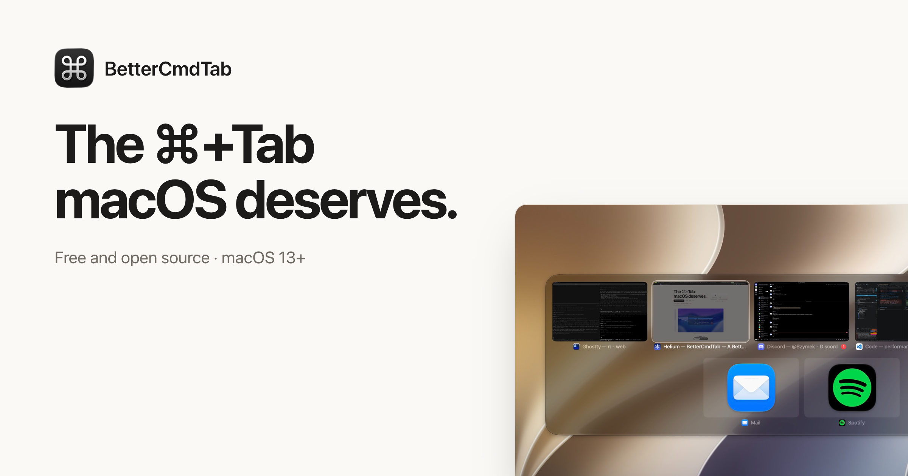
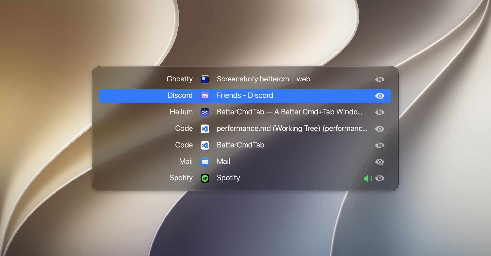
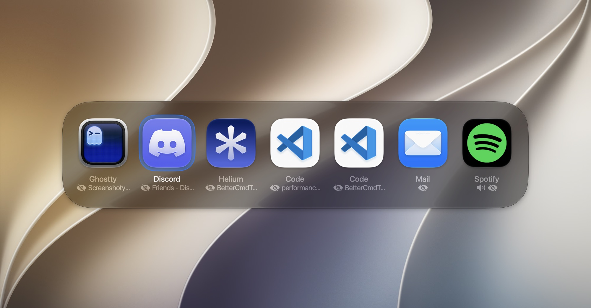
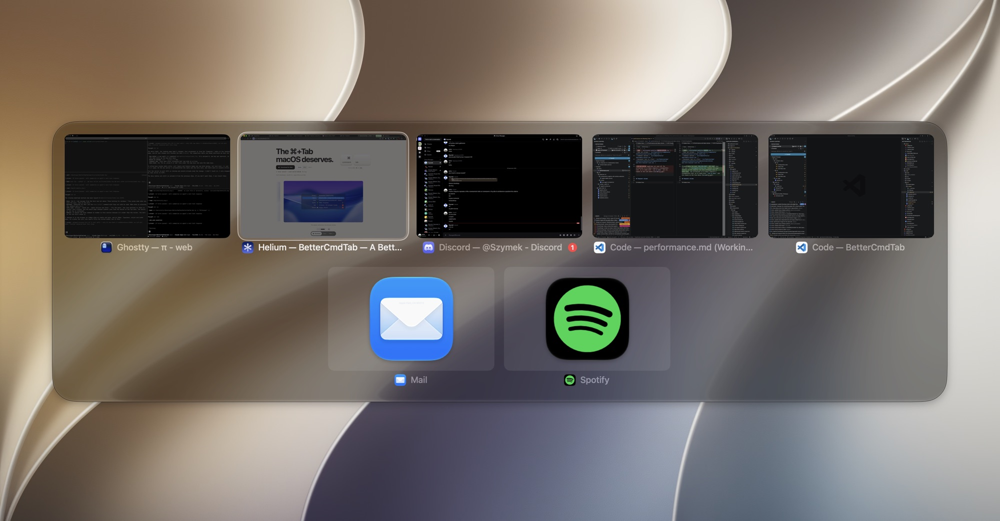

<div align="center">



<p>
  <a href="https://github.com/rokartur/BetterCmdTab/releases/latest"></a>
  <a href="https://github.com/rokartur/BetterCmdTab/releases/latest"></a>
  <a href="https://github.com/rokartur/BetterCmdTab/releases"></a>
</p>

<a href="https://bettercmdtab.app">Website</a> · <a href="https://bettercmdtab.app/docs/">Documentation</a> · <a href="README.zh-CN.md">简体中文</a>

</div>

A native ⌘Tab replacement for macOS. List, grid, or live window previews, with search, browser tabs, and window tiling built in. Free, open source, no telemetry.

## Install

```bash
brew install --cask bettercmdtab        # stable
brew install --cask bettercmdtab@beta   # beta
```

Or download the signed `.dmg` from [Releases](https://github.com/rokartur/BetterCmdTab/releases/latest). Requires macOS 13+.

On first launch, grant **Accessibility** in System Settings → Privacy & Security → Accessibility. Without it ⌘Tab does nothing.

## Layouts

| List | Grid | Previews |
| :-: | :-: | :-: |
|  |  |  |

## Features

**Switching**

- Tap ⌘Tab to switch instantly, hold to open the switcher. Shift steps backwards.
- Type a letter to jump, or press `/` to fuzzy-search windows and launch any installed app.
- `` ⌘` `` cycles the front app's windows. The scroll wheel moves the selection.
- Opens on the display you're working on. Can stay open after you release ⌘.
- Three-finger swipe opens the switcher or switches Spaces, with optional haptics.

**Windows and tabs**

- Press `\` to pick a tab: Safari, Chrome, Arc, Brave, Edge, Vivaldi, Opera, Dia, Finder, Terminal, iTerm. Or list every tab as its own row.
- Close, minimize, zoom, hide, quit, or force-quit (`⌘⌥Q`) right from the switcher.
- Tile with `⌃⌘` arrows (press again for ½ → ⅔ → ⅓), maximize, center, or send a window to the next display.

**Filtering**

- Sort by recent apps, recent windows, name, or launch order.
- Show all Spaces, the current one, or only what's visible on your displays.
- Pin favorites, hide apps, or let an app skip ⌘Tab (always or in fullscreen).
- Scoped hotkeys open a pre-filtered switcher with its own layout and rules.
- Nine app hotkeys focus or launch a chosen app directly.

**Everything else**

- Dock unread badges and a playing-audio indicator in the switcher.
- Reopen recently quit apps. Instant Space switching with no animation.
- Keeps working while a password field holds Secure Event Input.
- Hidden from screen sharing and recordings (macOS 14.6+).
- Opacity, corner radius, material, size, and grid columns. Follows your accent color and Reduce Motion.
- Export settings as JSON, or sync them live with `~/.config/bettercmdtab/config.json` (a generated `schema.json` gives editors autocomplete).

Every option is documented in the [docs](https://bettercmdtab.app/docs/).

## Privacy

No telemetry, analytics, crash reporting, or account. The only network requests go to GitHub, and only when checking for updates.

## Contributing

Issues and pull requests welcome. Build and test instructions are in [CONTRIBUTING.md](CONTRIBUTING.md#building).

## License

[GPL v3](LICENSE). Built by [@rokartur](https://github.com/rokartur), inspired by [AltTab](https://alt-tab.app/), [Witch](https://manytricks.com/witch/), and [Contexts](https://contexts.co/).
